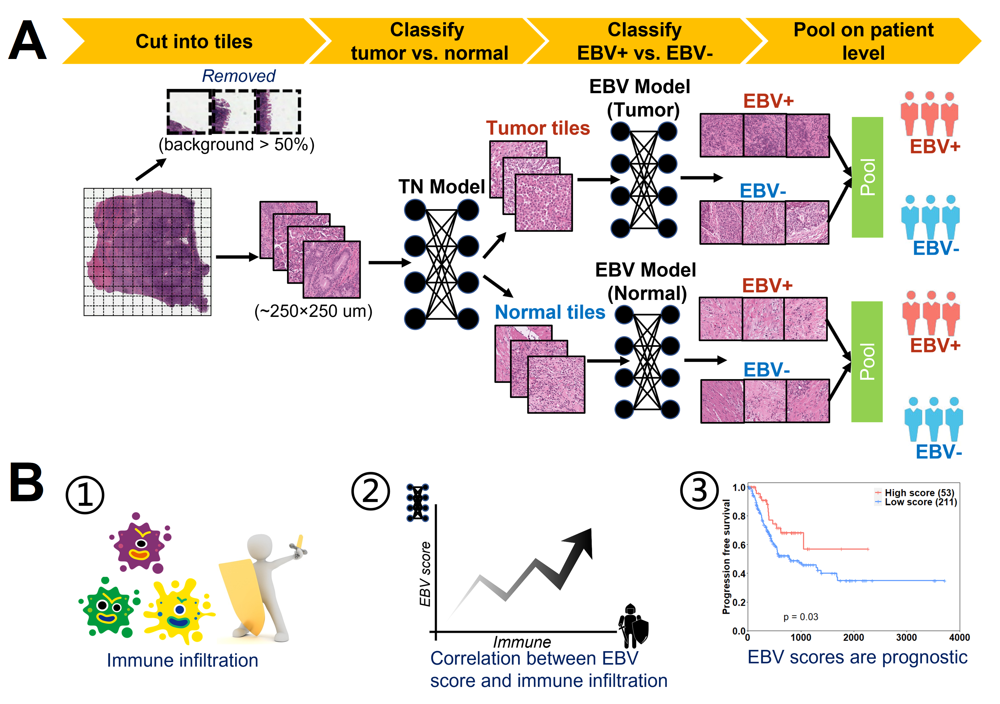

<p>
   </a>
</p>
<br>

## Deep Learning Predicts EBV Status in Gastric Cancer based on Spatial Patterns of Lymphocyte Infiltration
_**Baoyi Zhang<sup>1</sup>**, Kevin Yao<sup>2</sup>, Min Xu<sup>3</sup>, Jia Wu<sup>4</sup>, Chao Cheng<sup>5,*</sup>_</br></br>
### Table of Contents  
[Requirements](#requirements)  
[Overview](#overview)  
[Preprocess](#preprocess)  
[Training and Test](#training)  


<a name="requirements"></a>
### Requirements

* python 3.7
* openslides >= 3.3
* torch >= 1.9.1

<a name="overview"></a>
### Overview

This repository provides the codes for training and test the EBV infection detection model in the above article. First, a tumor vs. normal model was trained to classify each images into tumor or normal. Then, EBV prediction models were trained seperately on tumor and normal images. 
```src``` souce code
<a name="preprocess"></a>
### Preprocess

Run the xxx.py to cut large whole slide images into small tiles with 512\*512 pixels. 
```
$ python xxx.py 
```

Run the xxx.py to perform color normalizarion of all tiles using xxx methods. 
```
$ python xxx.py 
```

<a name="training"></a>
### Training and Test
#### Tumor vs. normal model
Run the train_tumor.py to train the tumor vs. normal model
```
$ python ./src/train_tumor.py --data <input data path> --mpath <model path> --lr 0.0001 --l2 0.000005 --non_improve 10 --epoch 150
```
```data```: The path for input data

```mpath```: The path to save the model

```lr```: Learning rate

```l2```: L2 regularization

```non_improve```: Early stop the training process when the loss in validation set doesn't decrease for specific epochs

```epoch```: Maximum epoches of training

Run the test_tumor.py to test the tumor vs. normal model
```
$ python ./src/test_tumor.py --data <input data path> --mpath <model path>
```
```data```: The path for input data

```mpath```: The path of the trained model

#### EBV model
Run the train_EBV.py to train the EBV model
```
$ python ./src/train_EBV.py --data <input data path> --mpath <model path> --lr 0.000001 --l2 0.0005 --non_improve 5 --epoch 150
```

Run the test_EBV.py to test the EBV model
```
$ python ./src/test_EBV.py --data <input data path> --mpath <model path>
```
